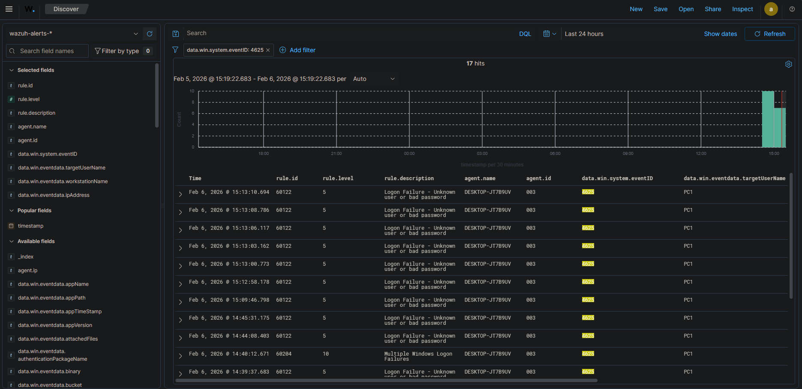

# Security Alert: Brute Force Login Attempt

## 1. Alert Information
* **Detection Tool:** Wazuh SIEM
* **Rule ID:** 60204 (Level 10 - High)
* **MITRE ATT&CK Mapping:** [T1110 – Brute Force](https://attack.mitre.org/techniques/T1110/)
* **Affected Asset:** `DESKTOP-JT7B9UV` (Windows 10)
* **Target User:** `PC1`
* **Log Source:** Windows Security Event Logs (Local Authentication)

---

## 2. Alert Description
This alert was triggered by a high volume of failed logon attempts (Event ID 4625) targeting a local account within a brief time window. Such activity is consistent with credential guessing or automated brute-force attacks.

## 3. Evidence & Investigation
* **Event ID:** 4625 (Logon Failure).
* **Observation:** Multiple authentication failures detected within a 5-minute window.
* **Logon Type:** Local authentication (Logon Type 2 - Interactive).
* **Source Attribution:** Source IP is not available as the attempts were initiated locally on the host.
* **Success Correlation:** Checked for **Event ID 4624** (Successful Logon) immediately following the failures; **No success observed**.

## 4. Analyst Assessment
* **Status:** **Suspected Brute Force Attempt**.
* **Confidence:** High.
* **Summary:** While no successful compromise was detected, the frequency of attempts suggests intentional malicious activity or a misconfigured local service. 

## 5. Recommended Actions
1. **User Verification:** Confirm with the user of `DESKTOP-JT7B9UV` if they experienced password issues or performed authorized testing.
2. **Account Hardening:** Review and enforce Account Lockout Policies to mitigate future brute-force risks.
3. **Continuous Monitoring:** Monitor for any subsequent successful logins or lateral movement attempts originating from this host.

---
**Analyst:** Khang Bao (Elon)  
**Incident Status:** Closed - Monitored  
**Date:** 2026-02-06
# Security Alert: Brute Force Login Attempt

## 1. Alert Information
* **Detection Tool:** Wazuh SIEM
* **Rule ID:** 60204 (Level 10 - High)
* **MITRE ATT&CK Mapping:** [T1110 – Brute Force](https://attack.mitre.org/techniques/T1110/)
* **Affected Asset:** `DESKTOP-JT7B9UV` (Windows 10)
* **Target User:** `PC1`
* **Log Source:** Windows Security Event Logs (Local Authentication)

---

## 2. Alert Description
This alert was triggered by a high volume of failed logon attempts (Event ID 4625) targeting a local account within a brief time window. Such activity is consistent with credential guessing or automated brute-force attacks.

## 3. Evidence & Investigation
* **Event ID:** 4625 (Logon Failure).
* **Observation:** Multiple authentication failures detected within a 5-minute window.
* **Logon Type:** Local authentication (Logon Type 2 - Interactive).
* **Source Attribution:** Source IP is not available as the attempts were initiated locally on the host.
* **Success Correlation:** Checked for **Event ID 4624** (Successful Logon) immediately following the failures; **No success observed**.

## 4. Analyst Assessment
* **Status:** **Suspected Brute Force Attempt**.
* **Confidence:** High.
* **Summary:** While no successful compromise was detected, the frequency of attempts suggests intentional malicious activity or a misconfigured local service. 

## 5. Recommended Actions
1. **User Verification:** Confirm with the user of `DESKTOP-JT7B9UV` if they experienced password issues or performed authorized testing.
2. **Account Hardening:** Review and enforce Account Lockout Policies to mitigate future brute-force risks.
3. **Continuous Monitoring:** Monitor for any subsequent successful logins or lateral movement attempts originating from this host.

---
**Analyst:** Khang Bao (Elon)  
**Incident Status:** Closed - Monitored  
**Date:** 2026-02-06
