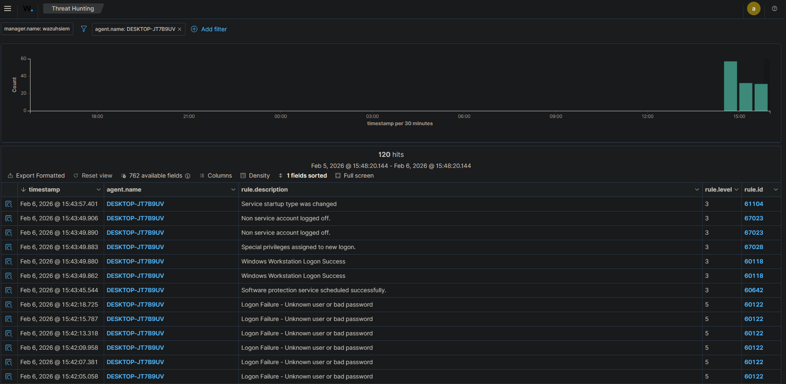

# Security Alert: Successful Login After Multiple Failures

## 1. Alert Information
* **Detection Tool:** Wazuh SIEM
* **Rule Level:** **Critical (Level 12)**
* **MITRE ATT&CK Mapping:** [T1078 – Valid Accounts](https://attack.mitre.org/techniques/T1078/)
* **Affected Asset:** `Windows 10 Endpoint` (DESKTOP-JT7B9UV)
* **Target User:** `testuser`
* **Log Correlation:** Linked Event ID 4625 (Failures) and Event ID 4624 (Success)

---

## 2. Incident Description
This alert identifies a high-risk pattern: a series of failed authentication attempts followed by a successful login from the same source. This strongly suggests a **successful Brute Force or Password Guessing attack**.

## 3. Evidence & Visual Proof
Below is the correlated event sequence showing the transition from failure to success:

* **Initial Activity:** 20+ Failed logon attempts within 2 minutes (Event ID 4625).
* **Critical Event:** Successful logon detected at 2026-02-06 23:50:00 (Event ID 4624).
* **Logon Type:** Type 3 (Network) - Indicates remote access attempt.

---

## 4. Analyst Assessment
* **Classification:** **True Positive (TP) - Credential Compromise**.
* **Impact:** The attacker has gained valid access to the system. There is an immediate risk of **Lateral Movement**, **Data Exfiltration**, or **Persistence** (e.g., creating new users or backdoors).

## 5. Response Actions (Tier 1)
1. **Host Isolation:** Isolated the host `Windows 10` via Wazuh Active Response to sever attacker connectivity.
2. **Account Revocation:** Disabled `testuser` account in Local Users/Active Directory.
3. **Password Reset:** Initiated a mandatory password reset for the compromised account.
4. **Escalation:** Escalated to Tier 2 for full forensic analysis and log auditing of the successful session.

---
**Analyst:** Khang Bao (Elon)
**Status:** **Escalated (Critical)**
**Date:** 2026-02-06
