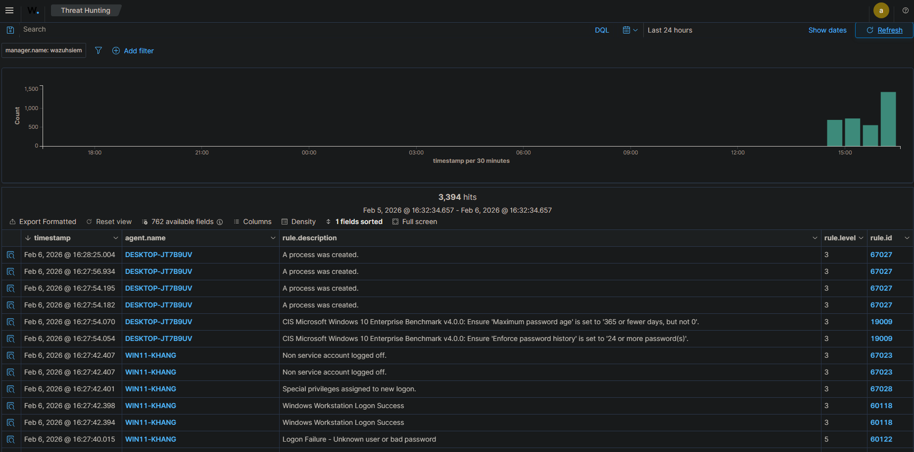

## Alert: Suspicious PowerShell Activity

- Detection Tool: Wazuh
- Rule ID: 18107
- Rule Level: Medium
- Affected Host: Windows 10
- User: Local User
- Process: powershell.exe

### Description
PowerShell was executed with suspicious command-line arguments
such as EncodedCommand or ExecutionPolicy Bypass.

### Evidence
- Windows Event ID 4688 (Process Creation)
- PowerShell execution with encoded command

### MITRE ATT&CK
- T1059.001 – PowerShell

