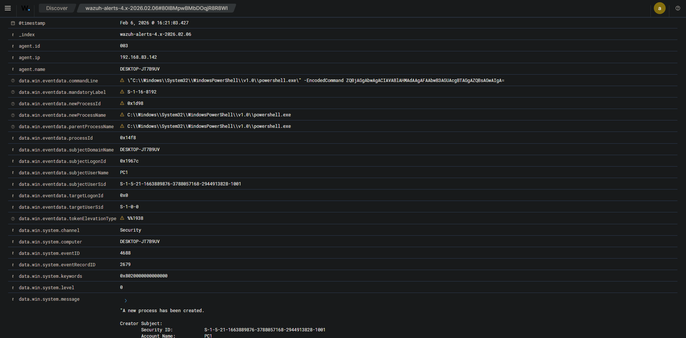

# Incident Response Playbook – Suspicious PowerShell Activity

## Alert Information
- Detection Tool: Wazuh
- Rule ID: 61613
- Rule Level: Medium
- MITRE ATT&CK: T1059.001 – PowerShell
- Affected Host: DESKTOP-JT7B9UV (Windows 10)
- User: Local User
- Process: powershell.exe

---

## Alert Description
This alert is triggered when PowerShell is executed on a Windows host.
Attackers often abuse PowerShell for malicious activities such as
payload execution, lateral movement, or persistence.

This alert may indicate suspicious PowerShell usage depending on
the execution context and command line.

---

## Initial Triage (Tier 1 Analysis)

### 1. Verify Alert Authenticity
- Confirm the alert source is Wazuh
- Verify the process name is `powershell.exe`
- Check event timestamp and affected host

### 2. Review Event Details
- Parent Process Name
- Command Line Arguments (if available)
- User Account executing PowerShell
- Logon Type and Privilege Level

---

## Investigation Steps

### 1. Check PowerShell Command Line
- Look for suspicious flags:
  - `-EncodedCommand`
  - `-ExecutionPolicy Bypass`
  - `-NoProfile`
- Identify encoded or obfuscated commands

### 2. Identify Parent Process
- Verify if PowerShell was launched by:
  - explorer.exe (usually benign)
  - winword.exe / excel.exe (potentially malicious)
  - cmd.exe / services.exe

### 3. Check User Behavior
- Is the user an admin?
- Is PowerShell commonly used by this user?
- Was the activity interactive or automated?

### 4. Correlate with Other Alerts
- Multiple PowerShell executions in a short time
- Related alerts:
  - Brute Force
  - Privilege Escalation
  - Suspicious Process Creation

---

## Evidence Collected
- Windows Event ID: 4688 (Process Creation)
- Process Name: powershell.exe
- Parent Process: explorer.exe
- Host: DESKTOP-JT7B9UV

---

## Assessment
- Severity: Medium
- Confidence: Low to Medium
- Classification: Suspicious Activity

This activity appears to be **benign administrative usage**  
OR  
**potential early-stage attack behavior** (depending on command line).

---

## Response Actions

### If Benign
- Close alert as **False Positive**
- Document user activity
- No further action required

### If Malicious
- Isolate the affected host
- Disable compromised user account
- Block malicious PowerShell scripts
- Escalate to Tier 2 SOC

---

## Recommendations
- Enable PowerShell Script Block Logging
- Monitor PowerShell execution frequency
- Apply least privilege principles
- User awareness training

---

## Status
- Alert Status: Closed
- Analyst: SOC Tier 1
- Date: 2026-02-06
